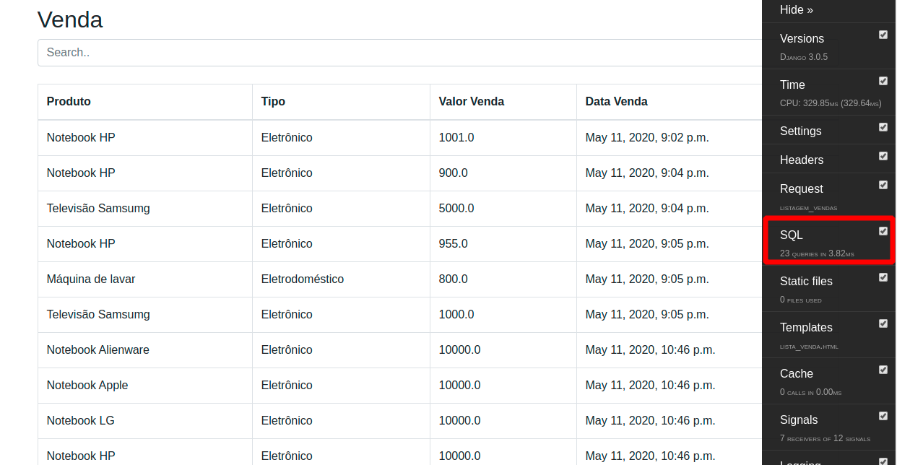
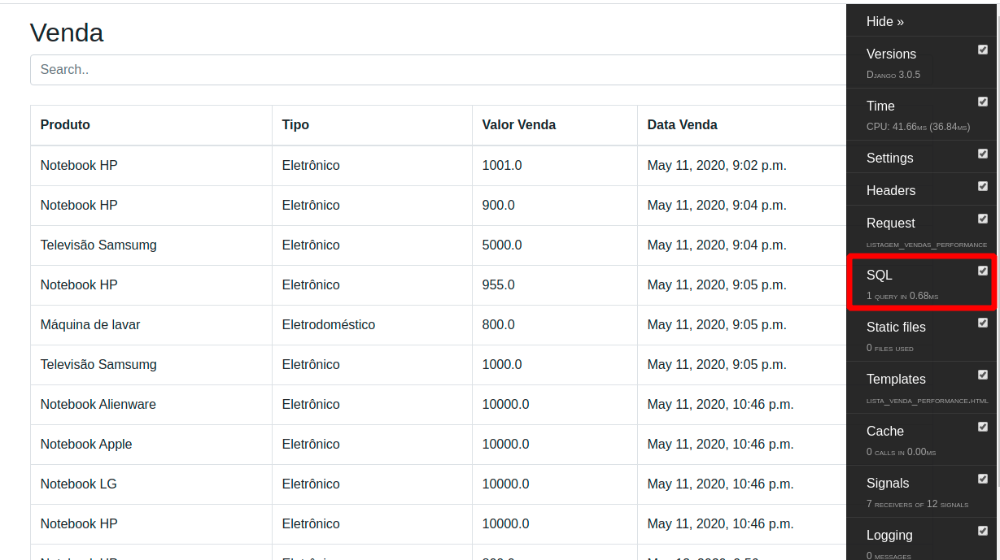

# Django ORM Performance

Este projeto está relacionado ao conteúdo explicado no meu canal do Youtube, para melhor entendimento acesse:

Projeto para demonstrar a diferença de performance entre uma consulta simples e uma consulta com select_related (join) quando uma FK for utilizada e campos especificados, evitando retornar dado desnecessário do banco de dados.

**sqlite3 já carregado e com informações para testes.**


Para utilizar, instale as bibliotecas requeridas.
```
pip install -r requirements.txt
```

Ponha a correr a aplicação.
```
python manage.py runserver
```

## Testes

https://127.0.0.1/vendas/

Aqui temos uma consulta total dos dados da tabela venda, onde, na listagem são acessados registro de FK, onde vemos que para cada item do registro é feito uma consulta nas tabelas relacionadas, com isso, temos uma quantidade grande de consultas, deixando baixa nossa performance no tópico de consulta no banco de dados.



https://127.0.0.1/vendas/performance

Aqui temos uma consulta total dos dados da tabela venda, mas já utilizando o select_related, que faz com que o join seja realizando no momento da consulta e não apenas quando for feito acesso as FK's. Com isso temos um grande ganho de performance. 
Aqui também é retornado apenas os campos utilizados, evitando trafegar dados desnecessários, o que também traz um ganho de performance.



**Admin User:** admin  
**Admin Password:** admin123
